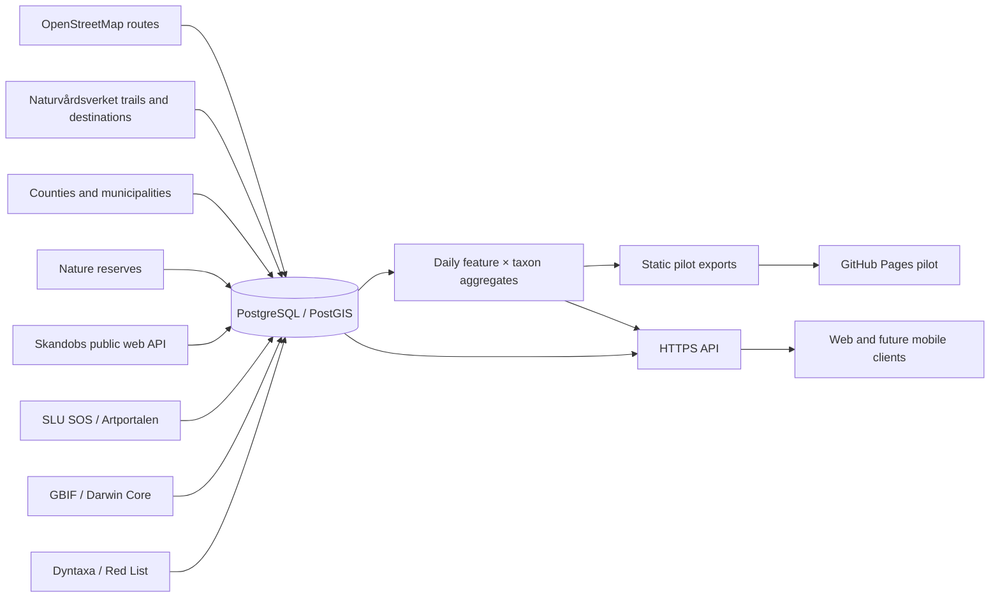

# VildaLeder

**Optimise your wildlife experiences**

VildaLeder is a Sweden-first discovery tool that connects marked walking and
hiking routes with recent biodiversity observations. The first product will be
an open, multilingual web application published through GitHub Pages. A native
iOS and Android application, accounts, subscriptions, and paid features are
possible later, after the public web MVP has demonstrated that the underlying
data and ranking are useful.

> Project status: functional Halland map/filter pilot with a complete SOS snapshot
> for OSM and Naturvårdsverket walking trails, nature reserves, and buffered
> birding destinations, plus experimental Halland-wide public Skandobs predator
> evidence. National-park support is active for the Sweden-wide catalog (Halland
> itself has no national park).
> The web MVP runs locally and is
> prepared for deployment at
> [jakubpelka.github.io/VildaLeder](https://jakubpelka.github.io/VildaLeder/).

## Product vision

Most nature-observation services begin with a map or a species database.
VildaLeder begins with a walk a person can actually take.

The product has two primary entry points:

### 1. Nature destination first

“I want to walk this trail. What has been observed nearby recently?”

1. Browse or search marked trails, protected areas, and birding destinations on
   a map.
2. Filter the map by Swedish county (`län`) and municipality (`kommun`).
3. Select a trail on the map or from the results list.
4. Zoom to the complete route.
5. Query public nature observations inside an approximately 200-metre corridor
   around the trail; inside a complete reserve/national-park polygon plus a
   200-metre outward buffer; or within 200 metres of a bird hide, observation
   tower, or observation platform.
6. Show recently observed species, prioritised by Swedish Red List category and
   accompanied by observation date, count, source, and data-quality context.
7. Change the time range: day, month, quarter, year, or custom dates.

### 2. Species first

“I want to look for a species such as havsörn. Which trails give me the best
chance of an interesting walk?”

1. Search by scientific name or a supported vernacular name.
2. Choose Sweden, a county, or a municipality.
3. Choose a time range.
4. Rank trails by observations of the selected species within their trail
   corridors.
5. Open a suggested trail to inspect the route, observation evidence, and the
   assumptions behind its ranking.

Observation count is evidence of past reporting, not a promise that a species
will be present. The interface must make that distinction clear.

## Initial scope

- Geography: Sweden.
- Trails: identifiable walking and hiking route relations from OpenStreetMap,
  plus walking-capable trails from Naturvårdsverket's **Leder och
  friluftsanordningar** dataset.
- Observation area: 200 metres on each side of a trail; for a nature reserve,
  the complete official protected-area polygon plus a 200-metre outward buffer.
  The exact spatial method and whether the width becomes configurable will be
  validated during discovery.
- Nature observations: public, georeferenced records from the SLU Species
  Observation System (including Artportalen) and/or GBIF.
- Conservation context: the current Swedish Red List and related conservation
  information from SLU Artdatabanken.
- Languages at launch: English, Swedish, and Polish.
- Access: public and anonymous; no account required.
- Delivery: responsive web application on GitHub Pages.

The current map catalog covers all six Halland municipalities: 175 named OSM
`route=hiking|foot` relations, 136 walking-capable Naturvårdsverket trails, 213
current Halland nature reserves, and 12 Naturvårdsverket birding destinations
(6 hides, 4 towers, and 2 platforms). Same-source NVV trail segments are grouped
by stable `Led_ID`; OSM and NVV records remain separate until cross-source
geometry/name matching can be calibrated without collapsing distinct routes.
Every municipality membership is retained for filtering. The UI has an explicit
pending state for partial refreshes rather than reporting a misleading zero. A
separate ten-year Skandobs snapshot currently adds 74 public wolf/lynx reports matched
90 times to 55 Halland trails or reserves; these places are explicitly labelled
as partial Skandobs-only coverage. Geographic filters are optional; the map
starts without object layers and asks the user to choose trails, protected
areas, observation infrastructure, national parks, or all places. Sweden-wide species discovery (including sparse species
such as harfågel or järv) requires the Phase 4 data platform described in the
roadmap.

## Features and User Interface

The application is a responsive web app built to present data smoothly without requiring user accounts or logins. The interface supports English, Swedish, and Polish.

### Exploration Journeys
- **Place-first**: An interactive map allows you to select trails, nature reserves, or observation infrastructure. The application fetches observations within a 200m buffer and visualizes recent sightings.
- **Species-first**: A dedicated search enables finding specific animals or plants using scientific or vernacular names. The application then highlights the trails and reserves where the species has been observed.

### Advanced Filtering and Data Visualization
- **Dynamic Time Ranges**: Filter observations by the last 24 hours, 30 days, 90 days, 365 days, or custom date ranges within a ten-year snapshot.
- **Red List Context**: Observations are sorted and grouped by Swedish Red List categories, bringing attention to endangered and vulnerable species.
- **Interactive Map Layers**: Selectively show or hide trails, reserves, bird hides, observation towers, and national parks. Opt-in browser geolocation tracks your position on the map.
- **Rich Data Representation**: Expandable tables show observation counts, dates, seasonality charts, and direct links to source records.

## System Architecture

VildaLeder processes data from several providers to build a cohesive nature map:
- **Routes and Areas**: OpenStreetMap relations, Naturvårdsverket trails, and Naturvårdsregistret reserves.
- **Observations**: SLU Species Observation System (Artportalen), Skandobs predator reports, and global GBIF records.
- **Processing**: Python geospatial routines buffer trails and perform spatial intersections with observation coordinates.
- **Data Platform**: A PostGIS database stores the deduplicated canonical observations. Daily aggregate partitions are generated and deployed as static JSON files.

For full technical details, setup instructions, and deployment guides, please see the [Development Setup Guide](docs/architecture/development.md).

## Product principles

1. **A walkable place is the unit of discovery.** Points and species become
   useful when they help someone choose or understand a trail or nature reserve.
2. **Show the evidence.** Rankings expose counts, dates, sources, and coverage
   instead of presenting an unexplained score.
3. **Do not expose sensitive wildlife.** VildaLeder uses only locations made
   public by the source and never attempts to reverse obfuscation or reveal
   protected nests, dens, or sites. Some source databases completely withhold
   sensitive records or publish only generalised locations, so missing public
   points must never be presented as proof that a species is absent.
4. **Conservation status is not a popularity score.** Red List category reflects
   extinction risk, not legal protection, beauty, or guaranteed rarity at a
   specific location.
5. **Design for imperfect data.** OSM routes may be fragmented or unnamed;
   observation density is affected by reporting effort, season, accessibility,
   and coordinate uncertainty.
6. **Keep source adapters replaceable.** Artportalen/SOS and GBIF have different
   identifiers, limits, update cycles, and taxonomies. Product logic must not be
   coupled to one response format.
7. **Earn complexity.** Authentication, payments, and native apps come after a
   useful anonymous web experience.

## Proposed system shape

The initial GitHub Pages application is static, but not every data operation can
run safely in a browser. The SLU developer portal issues an API key after product
subscription; that key must not be embedded in frontend JavaScript. The pilot
therefore uses a static JavaScript client and a Python data job which generates a
versioned, cacheable JSON snapshot. The always-on local server owns the 03:00
refresh, verifies a complete export, and pushes it to GitHub Pages; GitHub
Actions no longer performs a second partial data refresh. The accepted national
path is the implemented PostGIS schema plus an HTTPS API; static exports remain
available during that transition.

The localized first-visit welcome dialog has one optional functional cookie.
Choosing “don't show again” stores `vildaleder_welcome_dismissed=1` for one year
with `SameSite=Lax`; it contains no user identifier and is not used for
analytics. Closing with `×`, Escape, the backdrop, or “start exploring” dismisses
the dialog only for the current page.

GitHub Pages is suitable for an open prototype, but it is not the intended
hosting platform for a future commercial SaaS or subscription backend.

## Implemented pilot stack

- Web: standards-based HTML, CSS, and JavaScript modules with no build step.
- Map: MapLibre GL JS 5.11 with an OSM raster source, resilient resize handling,
  GPU-rendered trail/corridor layers, clickable Red List observation points,
  and opt-in two-second browser geolocation tracking.
- Localisation: checked-in UI dictionaries for `en`, `sv`, and `pl`.
- Spatial processing: Python, Shapely, and pyproj; corridors are calculated in
  SWEREF 99 TM (`EPSG:3006`) and exported as WGS84 GeoJSON.
- Data: route relations from OSM/Overpass, trails and visitor destinations from
  Naturvårdsverket, protected areas from Naturvårdsregistret, public Artportalen
  observations from SLU SOS, and an experimental whitelisted public Skandobs
  predator snapshot,
  stored as compact geometry/source artifacts and daily aggregate indexes.
- Scale target: PostgreSQL 18/PostGIS 3.6 with canonical observations,
  source-record provenance, native spatial matching, multilingual taxon names,
  and daily trail/reserve aggregates.
- Automation: Python contract tests, CI, a persistent local systemd timer for the
  complete PostGIS/SOS/OSM/Skandobs snapshot, and a GitHub Pages workflow.

This deliberately low-complexity frontend proves the two core journeys.
TypeScript, vector/PMTiles route delivery, a dedicated tile provider, and a
PostGIS-backed service remain scale-up options rather than prerequisites for
learning from the Halmstad pilot.

No basemap provider is selected yet. The public OpenStreetMap tile service is
best-effort and has a specific usage policy; a production or offline mobile app
must use a provider whose terms and capacity match the product.

## Data and ranking contract

### Trail identity

Each trail should retain its OSM relation ID, source version/timestamp, geometry,
name, reference, network level, operator, and available multilingual names. A
route without a stable name can be displayed with a deterministic fallback but
must not silently merge with another route.

### Spatial matching

- Build a metric 200-metre buffer around the complete route geometry.
- Query observations by the buffer polygon, not only by a route bounding box.
- Retain coordinate uncertainty and source precision where supplied.
- Deduplicate records using stable source identifiers before counting.
- Record the trail version, query time, observation source, filters, and data
  version so a result can be reproduced.

### Time ranges

- Day: rolling 24 hours by default.
- Month: rolling 30 days.
- Quarter: rolling 90 days.
- Year: rolling 365 days.
- Custom: explicit inclusive start and end dates.

The UI must display the interpreted dates and timezone rather than relying only
on labels such as “month”.

### Red List ordering

The default conservation ordering will follow the Swedish categories:

`RE → CR → EN → VU → NT → DD → LC → NE/NA`

Current observations of a taxon classified as regionally extinct (`RE`) require
special presentation because they may represent historical data, a taxonomic
change, or a record needing validation. Category, assessment year, and source
must be shown. Users will also be able to switch to recency, observation count,
or alphabetical sorting.

The pilot currently displays the category returned in
`taxon.attributes.redlistCategory` by SOS. The search response does not provide
the assessment year, so the UI does not claim a Red List edition. Explicit 2025
assessment provenance remains a pre-expansion data-contract task.

### Species-to-trail ranking

The first transparent baseline is the number of deduplicated observations inside
the trail corridor and selected period. Raw counts are biased by trail length and
reporting effort, so the results should also expose:

- observations per kilometre;
- number of distinct observation dates;
- most recent observation;
- coordinate precision and validation status when available;
- corridor area and trail length;
- data-source coverage.

A composite “best trail” score will not be introduced until the baseline can be
evaluated against real examples.

## Multilingual search

The UI and all product-owned content will ship in English, Swedish, and Polish.
Taxon search will support:

- accepted scientific names;
- scientific synonyms;
- recommended Swedish names from Dyntaxa;
- available English and Polish names from authoritative sources;
- a curated alias layer where authoritative coverage is incomplete;
- accent-insensitive autocomplete with the scientific name always visible.

The canonical identity is a source taxon identifier, never the displayed name.

## Data safety and limitations

- Only public observations are in scope for anonymous users.
- Obfuscated or withheld source coordinates stay obfuscated or withheld.
- Some sensitive taxa and observations are unavailable in public source output;
  absence from VildaLeder is therefore not evidence of ecological absence.
- Observation locations must not be interpreted as trail safety guidance or
  permission to enter private/restricted land.
- Trail presence in OSM or Naturvårdsverket data does not guarantee that it is
  open, maintained, safe, or legally accessible at the selected time.
- Seasonal closures, fire restrictions, hunting, weather, accessibility, and
  transport are valuable future layers but are outside the first MVP.
- All source attribution and downstream licence obligations must be visible and
  auditable before launch.
- The snapshot is evidence of reported observations, not a probability model or
  a promise that a species will be present.
- The standard OpenStreetMap tile service is used only at pilot scale; it is not
  the selected production or offline basemap.
- Common-name autocomplete uses the available Swedish, English, and Polish GBIF
  enrichment plus scientific names; missing vernacular names fall back to the
  scientific name.

## Roadmap

See [ROADMAP.md](ROADMAP.md) for milestones, acceptance criteria, risks, and the
path from data discovery to web MVP and native mobile applications.

## Authoritative references

- [OpenStreetMap hiking route tagging](https://wiki.openstreetmap.org/wiki/Tag:route%3Dhiking)
- [OpenStreetMap copyright and attribution](https://www.openstreetmap.org/copyright)
- [Overpass API documentation and public-instance policy](https://wiki.openstreetmap.org/wiki/Overpass_API)
- [Nominatim search API](https://nominatim.org/release-docs/latest/api/Search/)
- [Nominatim usage policy](https://operations.osmfoundation.org/policies/nominatim/)
- [OpenStreetMap tile usage policy](https://operations.osmfoundation.org/policies/tiles/)
- [SLU overview of open data and APIs](https://www.slu.se/artdatabanken/rapportering-och-fynd/oppna-data-och-apier/om-slu-artdatabankens-apier)
- [SLU Species Observation System API capabilities](https://www.slu.se/artdatabanken/rapportering-och-fynd/oppna-data-och-apier/om-slu-artdatabankens-apier/api-for-artobservationer-fran-flera-dataset/)
- [Naturvårdsregistret REST API](https://geodata.naturvardsverket.se/naturvardsregistret/rest/v3/)
- [Naturvårdsverket Leder och friluftsanordningar downloads and WFS](https://geodata.naturvardsverket.se/nedladdning/friluftsliv/)
- [Skandobs](https://www.skandobs.se/) — experimental source for public
  large-predator reports through the web client's anonymous API. The adapter is
  deliberately best-effort because no stability or redistribution contract has
  been found. See the
  [source evaluation](docs/discovery/skandobs-evaluation.md).
- [Species Observation System technical repository](https://github.com/biodiversitydata-se/SOS)
- [Dyntaxa taxonomy API overview](https://www.slu.se/artdatabanken/rapportering-och-fynd/oppna-data-och-apier/om-slu-artdatabankens-apier/apier-for-taxonomisk-information/)
- [Swedish Red List 2025](https://www.slu.se/artdatabanken/publikationer/rodlistor/rodlista-2025/)
- [GBIF Occurrence API](https://techdocs.gbif.org/en/openapi/v1/occurrence)
- [SCB digital county and municipality boundaries](https://www.scb.se/hitta-statistik/regional-statistik-och-kartor/regionala-indelningar/digitala-granser/)
- [MapLibre GL JS](https://maplibre.org/maplibre-gl-js/docs/)
- [GitHub Pages limits](https://docs.github.com/en/pages/getting-started-with-github-pages/github-pages-limits)

## Licence

Project code is licensed under the [Apache License 2.0](LICENSE). It permits
open use, modification, distribution, and commercial use while retaining
copyright, licence, and notice obligations. This code licence does not replace
the separate attribution and downstream obligations of OSM, Artportalen/SOS, or
other source datasets.
