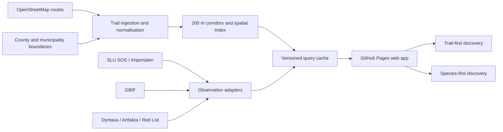

# VildaLeder

**Find wildlife by trail — or find a trail by wildlife.**

VildaLeder is a Sweden-first discovery tool that connects marked walking and
hiking routes with recent biodiversity observations. The first product will be
an open, multilingual web application published through GitHub Pages. A native
iOS and Android application, accounts, subscriptions, and paid features are
possible later, after the public web MVP has demonstrated that the underlying
data and ranking are useful.

> Project status: concept and data-discovery phase. No production application
> has been released yet.

## Product vision

Most nature-observation services begin with a map or a species database.
VildaLeder begins with a walk a person can actually take.

The product has two primary entry points:

### 1. Trail first

“I want to walk this trail. What has been observed nearby recently?”

1. Browse or search marked trails on a map.
2. Filter the map by Swedish county (`län`) and municipality (`kommun`).
3. Select a trail on the map or from the results list.
4. Zoom to the complete route.
5. Query public nature observations inside an approximately 200-metre corridor
   around the trail.
6. Show recently observed species, prioritised by Swedish Red List category and
   accompanied by observation date, count, source, and data-quality context.
7. Change the time range: day, month, quarter, year, or custom dates.

### 2. Species first

“I want to look for a species such as havsörn. Which trails give me the best
chance of an interesting walk?”

1. Search by scientific name or a supported vernacular name.
2. Choose Sweden, a county, or a municipality.
3. Choose a time range.
4. Rank trails by observations of the selected species within their trail
   corridors.
5. Open a suggested trail to inspect the route, observation evidence, and the
   assumptions behind its ranking.

Observation count is evidence of past reporting, not a promise that a species
will be present. The interface must make that distinction clear.

## Initial scope

- Geography: Sweden.
- Trails: identifiable walking and hiking route relations from OpenStreetMap,
  initially `type=route` with `route=hiking` or `route=foot`.
- Observation corridor: 200 metres on each side of the trail by default. The
  exact spatial method and whether the width becomes configurable will be
  validated during discovery.
- Nature observations: public, georeferenced records from the SLU Species
  Observation System (including Artportalen) and/or GBIF.
- Conservation context: the current Swedish Red List and related conservation
  information from SLU Artdatabanken.
- Languages at launch: English, Swedish, and Polish.
- Access: public and anonymous; no account required.
- Delivery: responsive web application on GitHub Pages.

The web MVP will focus on one representative pilot area before expanding to all
of Sweden. Hallands län is a natural pilot candidate, but the final pilot region
will be selected after trail completeness and API-volume measurements.

## Product principles

1. **A route is the unit of discovery.** Points and species become useful when
   they help someone choose or understand a walk.
2. **Show the evidence.** Rankings expose counts, dates, sources, and coverage
   instead of presenting an unexplained score.
3. **Do not expose sensitive wildlife.** VildaLeder uses only locations made
   public by the source and never attempts to reverse obfuscation or reveal
   protected nests, dens, or sites.
4. **Conservation status is not a popularity score.** Red List category reflects
   extinction risk, not legal protection, beauty, or guaranteed rarity at a
   specific location.
5. **Design for imperfect data.** OSM routes may be fragmented or unnamed;
   observation density is affected by reporting effort, season, accessibility,
   and coordinate uncertainty.
6. **Keep source adapters replaceable.** Artportalen/SOS and GBIF have different
   identifiers, limits, update cycles, and taxonomies. Product logic must not be
   coupled to one response format.
7. **Earn complexity.** Authentication, payments, and native apps come after a
   useful anonymous web experience.

## Proposed system shape

The initial GitHub Pages application is static, but not every data operation can
run safely in a browser. The SLU developer portal issues an API key after product
subscription; that key must not be embedded in frontend JavaScript. The likely
MVP pattern is therefore:

- a static TypeScript web client;
- public browser calls only where the upstream service explicitly supports
  them;
- scheduled or on-demand data jobs using GitHub Actions secrets;
- small, versioned, cacheable data products consumed by the web client;
- a thin backend or serverless API later if freshness and query variety require
  it.

GitHub Pages is suitable for an open prototype, but it is not the intended
hosting platform for a future commercial SaaS or subscription backend.

## Candidate technology stack

The stack is intentionally provisional until the discovery milestones are
complete.

- Web: TypeScript, React, Vite.
- Map: MapLibre GL JS with a production-suitable OSM-derived tile provider.
- Localisation: i18next with checked-in locale files for `en`, `sv`, and `pl`.
- Spatial processing: Python with GeoPandas/Shapely or an equivalent reproducible
  geospatial pipeline; Turf.js only for lightweight client-side operations.
- Data interchange: GeoJSON for small pilot datasets, moving to vector tiles or
  partitioned columnar data when national volume requires it.
- Automation: GitHub Actions for tests, data refresh, and GitHub Pages deploys.
- Mobile later: evaluate a shared TypeScript domain layer with React Native/Expo
  versus a dedicated MapLibre Native application.

No basemap provider is selected yet. The public OpenStreetMap tile service is
best-effort and has a specific usage policy; a production or offline mobile app
must use a provider whose terms and capacity match the product.

## Data and ranking contract

### Trail identity

Each trail should retain its OSM relation ID, source version/timestamp, geometry,
name, reference, network level, operator, and available multilingual names. A
route without a stable name can be displayed with a deterministic fallback but
must not silently merge with another route.

### Spatial matching

- Build a metric 200-metre buffer around the complete route geometry.
- Query observations by the buffer polygon, not only by a route bounding box.
- Retain coordinate uncertainty and source precision where supplied.
- Deduplicate records using stable source identifiers before counting.
- Record the trail version, query time, observation source, filters, and data
  version so a result can be reproduced.

### Time ranges

- Day: rolling 24 hours by default.
- Month: rolling 30 days.
- Quarter: rolling 90 days.
- Year: rolling 365 days.
- Custom: explicit inclusive start and end dates.

The UI must display the interpreted dates and timezone rather than relying only
on labels such as “month”.

### Red List ordering

The default conservation ordering will follow the Swedish categories:

`RE → CR → EN → VU → NT → DD → LC → NE/NA`

Current observations of a taxon classified as regionally extinct (`RE`) require
special presentation because they may represent historical data, a taxonomic
change, or a record needing validation. Category, assessment year, and source
must be shown. Users will also be able to switch to recency, observation count,
or alphabetical sorting.

### Species-to-trail ranking

The first transparent baseline is the number of deduplicated observations inside
the trail corridor and selected period. Raw counts are biased by trail length and
reporting effort, so the results should also expose:

- observations per kilometre;
- number of distinct observation dates;
- most recent observation;
- coordinate precision and validation status when available;
- corridor area and trail length;
- data-source coverage.

A composite “best trail” score will not be introduced until the baseline can be
evaluated against real examples.

## Multilingual search

The UI and all product-owned content will ship in English, Swedish, and Polish.
Taxon search will support:

- accepted scientific names;
- scientific synonyms;
- recommended Swedish names from Dyntaxa;
- available English and Polish names from authoritative sources;
- a curated alias layer where authoritative coverage is incomplete;
- accent-insensitive autocomplete with the scientific name always visible.

The canonical identity is a source taxon identifier, never the displayed name.

## Data safety and limitations

- Only public observations are in scope for anonymous users.
- Obfuscated or withheld source coordinates stay obfuscated or withheld.
- Observation locations must not be interpreted as trail safety guidance or
  permission to enter private/restricted land.
- Trail presence in OSM does not guarantee that it is open, maintained, safe, or
  legally accessible at the selected time.
- Seasonal closures, fire restrictions, hunting, weather, accessibility, and
  transport are valuable future layers but are outside the first MVP.
- All source attribution and downstream licence obligations must be visible and
  auditable before launch.

## Roadmap

See [ROADMAP.md](ROADMAP.md) for milestones, acceptance criteria, risks, and the
path from data discovery to web MVP and native mobile applications.

## Authoritative references

- [OpenStreetMap hiking route tagging](https://wiki.openstreetmap.org/wiki/Tag:route%3Dhiking)
- [OpenStreetMap copyright and attribution](https://www.openstreetmap.org/copyright)
- [Overpass API documentation and public-instance policy](https://wiki.openstreetmap.org/wiki/Overpass_API)
- [OpenStreetMap tile usage policy](https://operations.osmfoundation.org/policies/tiles/)
- [SLU overview of open data and APIs](https://www.slu.se/artdatabanken/rapportering-och-fynd/oppna-data-och-apier/om-slu-artdatabankens-apier)
- [SLU Species Observation System API capabilities](https://www.slu.se/artdatabanken/rapportering-och-fynd/oppna-data-och-apier/om-slu-artdatabankens-apier/api-for-artobservationer-fran-flera-dataset/)
- [Species Observation System technical repository](https://github.com/biodiversitydata-se/SOS)
- [Dyntaxa taxonomy API overview](https://www.slu.se/artdatabanken/rapportering-och-fynd/oppna-data-och-apier/om-slu-artdatabankens-apier/apier-for-taxonomisk-information/)
- [Swedish Red List 2025](https://www.slu.se/artdatabanken/publikationer/rodlistor/rodlista-2025/)
- [GBIF Occurrence API](https://techdocs.gbif.org/en/openapi/v1/occurrence)
- [SCB digital county and municipality boundaries](https://www.scb.se/hitta-statistik/regional-statistik-och-kartor/regionala-indelningar/digitala-granser/)
- [MapLibre GL JS](https://maplibre.org/maplibre-gl-js/docs/)
- [GitHub Pages limits](https://docs.github.com/en/pages/getting-started-with-github-pages/github-pages-limits)

## Licence

No project-code licence has been selected yet. Choosing one is a discovery
milestone because code licensing and the attribution/share-alike obligations of
source datasets are separate decisions.
