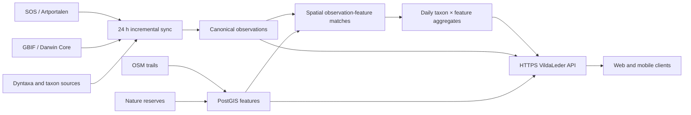

# PostGIS data platform

Status: target architecture accepted for the Sweden-wide VildaLeder service.

## Decision

PostgreSQL with PostGIS is the system of record for observations, taxonomy,
trails, nature reserves, administrative areas, spatial matches, and daily
aggregates. The repository uses PostgreSQL 18 with PostGIS 3.6 for local
development. Static JSON remains an export format for the GitHub Pages pilot,
not the canonical national datastore.

The database is deliberately source-aware. An observation is stored once, then
linked to any number of trails or reserves. Provider records from SOS, GBIF, or
future sources point to that canonical observation, allowing cross-provider
deduplication without discarding provenance.



## Core model

- `taxon` is the canonical product taxon; `taxon_external_id` preserves SOS,
  Dyntaxa, GBIF, and other identifiers.
- `taxon_name` stores any number of scientific, vernacular, and synonym names.
  Every row has a BCP 47 language code, source, preferred flag, and source name
  ID. Scientific names use `zxx` (not linguistic content); unknown language uses
  `und`.
- `observation` is the canonical occurrence used for counting.
  `observation_source_record` retains provider IDs, URLs, update state, and
  provenance. A later matcher may attach a GBIF record and an Artportalen record
  to the same canonical observation.
- `spatial_feature` represents either a trail or nature reserve. `geom` is the
  display/source geometry; `analysis_geom` is the 200 m trail corridor or reserve
  polygon used for matching.
- `observation_feature` is the versioned many-to-many spatial match. The same
  observation can support several overlapping trails and reserves without
  duplicating the observation.
- `daily_feature_taxon` is the serving aggregate behind date-sensitive counts
  and species rankings. A rolling date window can be rebuilt transactionally
  after every sync.

Geometry columns use WGS84 (`EPSG:4326`) and GiST indexes. PostGIS spatial
predicates first use index-backed bounding-box filtering and then exact geometry
tests. Administrative filters are separate many-to-many relations so a route
crossing a municipal or county boundary is represented correctly.

## Names and Darwin Core/GBIF

The model maps source fields instead of treating Darwin Core as the database
schema:

| Source concept | Storage |
| --- | --- |
| `dwc:taxonID` / GBIF usage key | `taxon_external_id` |
| `dwc:scientificName` | `taxon_name(name_kind='scientific', language_code='zxx')` |
| `dwc:vernacularName` | one or more language-labelled `taxon_name` rows |
| accepted name usage | `taxon.accepted_taxon_id` plus source ID provenance |
| occurrence/provider ID | `observation_source_record` |
| public coordinates and uncertainty | `observation.geom`, `coordinate_uncertainty_m` |
| `dataGeneralizations` / `informationWithheld` | explicit observation fields |

Source priority is decided per language and recorded, not hard-coded into three
columns. Dyntaxa/SLU is the preferred authority for Swedish taxon identity and
Swedish names; GBIF checklist data can add available English, Polish, other
vernacular names, synonyms, and identifiers. Missing names fall back to the
scientific name and are never machine-invented silently.

## Daily synchronization

1. Load provider changes into staging tables with `COPY`.
2. Upsert source records and canonical taxa/observations using stable source IDs.
3. Re-fetch a rolling correction window to capture edits and deletions.
4. Match changed public points to changed/current analysis geometries with
   `ST_Intersects` and GiST indexes.
5. Rebuild `daily_feature_taxon` only for affected dates/features.
6. Mark `sync_run` complete and advance `sync_cursor` in the same successful
   workflow. Readers keep the last complete state if a sync fails.
7. Export measured static artifacts while the GitHub Pages client remains in
   use; later serve the same model through the API.

The nationwide retention, caching, redistribution, and sensitive-location rules
must be approved before the full backfill. Only public/source-approved geometry
is stored in the serving database.

## Local hosting and network boundary

The database and API can run on a privately owned local server. Buying managed
hosting is not required for the MVP. The public boundary is the HTTPS API:

- never expose PostgreSQL port `5432` to the public internet;
- bind the development port to `127.0.0.1` and keep production PostGIS on a
  private container/network segment;
- expose only reverse-proxied HTTPS (`443`) for the API, with rate limits, CORS,
  monitoring, and administrative authentication;
- use an outbound tunnel if the server is behind CGNAT or inbound ports are not
  desirable;
- keep daily encrypted off-machine backups and regularly test restore;
- expect migration to managed infrastructure only if uptime, bandwidth,
  concurrency, or operations justify it.

## Local development

Set the ignored `.env` values shown in `.env.example`, then run:

```bash
docker compose up -d database
.venv/bin/python scripts/migrate_postgis.py
.venv/bin/python scripts/import_postgis.py
.venv/bin/python scripts/verify_postgis.py
```

The container binds only to localhost. The first empty-volume startup applies
`db/migrations/001_initial.sql`; the explicit migration command is idempotent and
is the path used for existing environments and CI.
